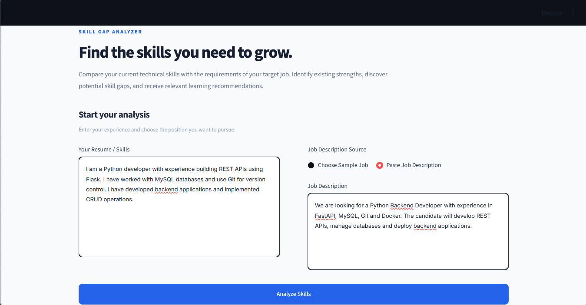
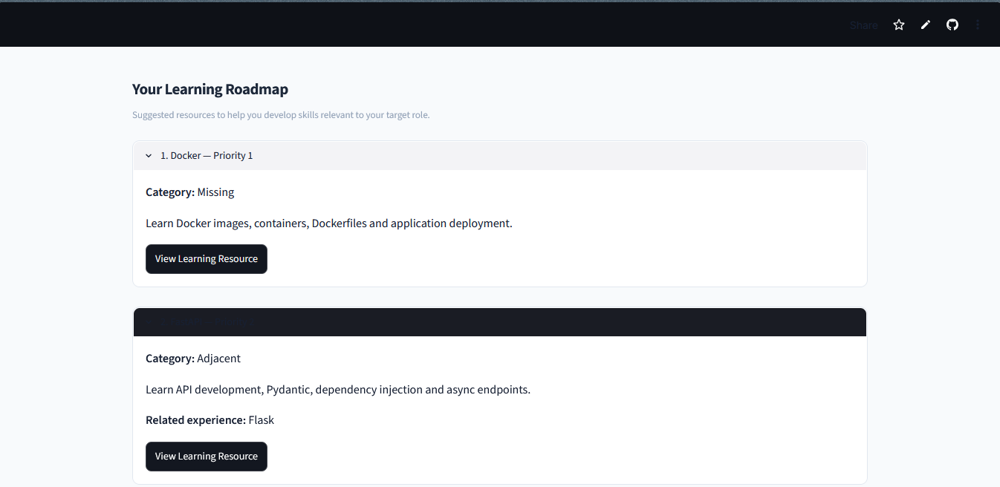
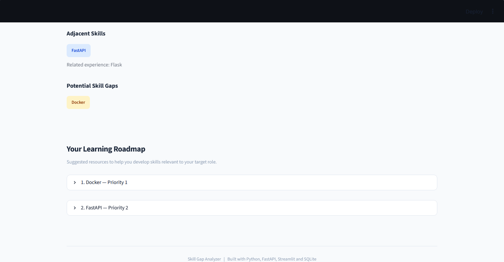

# Skill Gap Analyzer

A full-stack Python application that compares a
candidate's resume with a target job description,
identifies potential skill gaps, and generates a
personalized learning roadmap.

## Live Demo

- Frontend: https://skill-gap-analyzer-apii.streamlit.app/
- Backend API: https://skill-gap-analyzer-e58c.onrender.com
- API Documentation: https://skill-gap-analyzer-e58c.onrender.com/docs

## Features

- Resume and job-description text analysis
- NLP-based technical skill extraction
- Skill alias normalization
- Matched, adjacent and missing skill comparison
- Personalized learning recommendations
- Curated learning resources
- Sample job selection from SQLite
- Interactive Streamlit dashboard
- REST API with FastAPI

## Tech Stack

| Layer | Technology |
|---|---|
| Language | Python |
| Backend | FastAPI |
| NLP | spaCy |
| Frontend | Streamlit |
| Database | SQLite |
| Testing | pytest |
| Containerization | Docker |
| Backend hosting | Render |
| Frontend hosting | Streamlit Community Cloud |

## How It Works

1. The user enters resume text.
2. The user selects or pastes a job description.
3. spaCy PhraseMatcher identifies known skills.
4. The comparison engine identifies exact matches,
   adjacent skills and potentially missing skills.
5. The roadmap generator recommends learning
   resources for the identified gaps.
6. Streamlit displays the results.

## Project Structure

    backend/
      data/
      services/
      database.py
      main.py
      schemas.py

    frontend/
      app.py
      requirements.txt

    tests/
    Dockerfile
    requirements.txt

## Running Locally

Create and activate a Python virtual environment.

Install dependencies:

    pip install -r requirements.txt

Install the spaCy English model:

    python -m spacy download en_core_web_sm

Start the backend:

    uvicorn backend.main:app --reload

In a second terminal, start Streamlit:

    streamlit run frontend/app.py

Open http://localhost:8501.

## API Endpoints

| Method | Endpoint | Description |
|---|---|---|
| GET | /health | Backend health check |
| GET | /jobs | List sample jobs |
| GET | /jobs/{job_id} | Retrieve a job |
| POST | /analyze | Analyze potential skill gaps |

## Running Tests

    python -m pytest -v

## Limitations

- The parser uses a curated technical skill taxonomy.
- Skill mentions do not necessarily demonstrate proficiency.
- Negation and experience context are not fully supported.
- The sample jobs are fictional.
- SQLite storage on the free backend is ephemeral.

## Future Improvements

- PDF resume upload
- Context-aware skill extraction
- Skill proficiency assessment
- Larger job-description dataset
- Learning roadmap customization

## Privacy

Avoid submitting sensitive personal information.
Resume text is transmitted to the backend for analysis.

## Screenshots

## Author

YOUR_NAME
YOUR_GITHUB_PROFILE
